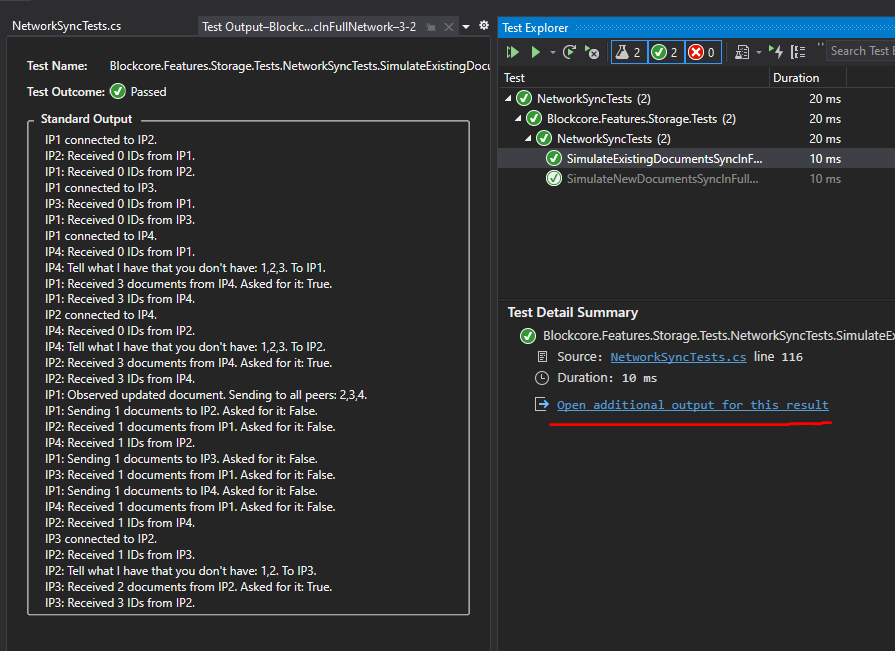

# network-node-sync

Basic demonstration on sync algorithm between nodes in a network.

When you run the tests from Visual Studio, you can open the additional output to get a log of sync processing.

## Contributions

Please feel free to provide pull request with improvments, bug fixes, suggestions, etc.